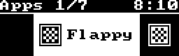

# SteelSeries Keyboard OS

The term "OS" is a little misleading. This is simply a program that renders "apps", built in C#, from your computer and displays them on the OLED display of SteelSeries keyboards.

